```
library(ggplot2) # for graphics
library(MASS) # for maximum likelihood estimation

z <- read.table("Gorischek_pollen_seed.csv",header=TRUE,sep=",", stringsAsFactors=FALSE)
str(z)
summary(z)
summary(z$Bud_Number)

    Min. 1st Qu.  Median    Mean 
    0.0    16.0    38.0    48.6 
  3rd Qu.  Max. 
   71.0   213.0 
   
```

### plot histogram of data

```
p1 <- ggplot(data=z, aes(x=Bud_Number, y=..density..)) +
  geom_histogram(color="grey60",fill="cornsilk",size=0.2) 
print(p1)

```

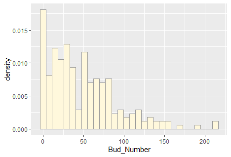


### add empirical density curve

```
p1 <-  p1 +  geom_density(linetype="dotted",size=0.75)
print(p1)

```

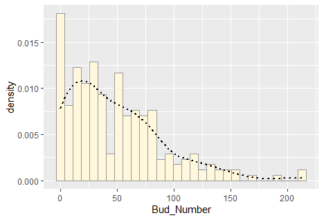


### Get maximum likelihood parameters for normal

```
normPars <- fitdistr(z$Bud_Number,"normal")
print(normPars)

mean         sd    
  48.597333   41.867348 
 ( 2.742821) ( 1.939467)
 
str(normPars)

List of 5
 $ estimate: Named num [1:2] 48.6 41.9
  ..- attr(*, "names")= chr [1:2] "mean" "sd"
 $ sd      : Named num [1:2] 2.74 1.94
  ..- attr(*, "names")= chr [1:2] "mean" "sd"
 $ vcov    : num [1:2, 1:2] 7.52 0 0 3.76
  ..- attr(*, "dimnames")=List of 2
  .. ..$ : chr [1:2] "mean" "sd"
  .. ..$ : chr [1:2] "mean" "sd"
 $ n       : int 233
 $ loglik  : num -1201
 - attr(*, "class")= chr "fitdistr"
 
 
normPars$estimate["mean"] # This is the structure of getting a named attribute

mean 
48.59733 

```

### plot normal probability density

```
meanML <- normPars$estimate["mean"]
sdML <- normPars$estimate["sd"]

xval <- seq(0,max(z$Bud_Number),len=length(z$Bud_Number))

stat <- stat_function(aes(x = xval, y = ..y..), fun = dnorm, colour="red", n = length(z$Bud_Number), args = list(mean = meanML, sd = sdML))
p1 + stat

```

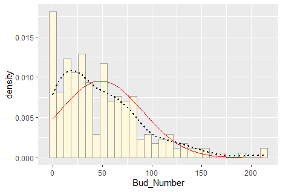

#### the data is skewed to the right. there are more values less than zero and this may pose a problem when plotting the gamma distribution

### plot exponential probability density

```
expoPars <- fitdistr(z$Bud_Number,"exponential")
rateML <- expoPars$estimate["rate"]

stat2 <- stat_function(aes(x = xval, y = ..y..), fun = dexp, colour="blue", n = length(z$Bud_Number), args = list(rate=rateML))
p1 + stat + stat2

```

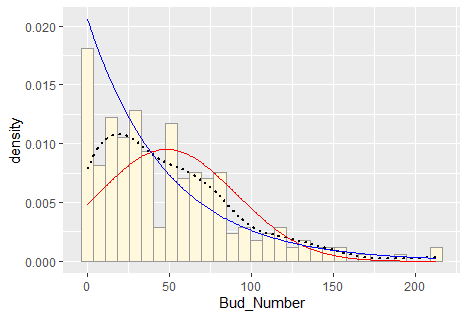


### plot uniform probability density

```
stat3 <- stat_function(aes(x = xval, y = ..y..), fun = dunif, colour="darkgreen", n = length(z$Bud_Number), args = list(min=min(z$Bud_Number), max=max(z$Bud_Number)))
p1 + stat + stat2 + stat3

```


#### plot gamma probability density

```
gammaPars <- fitdistr(z$Bud_Number,"gamma")
```
*Error in stats::optim(x = c(2, 3, 3, 11, 7, 7, 6, 6, 6, 7, 10, 13, 16,  : 
  initial value in 'vmmin' is not finite*
 
``` 
shapeML <- gammaPars$estimate["shape"]
rateML <- gammaPars$estimate["rate"]
```
*Error: object 'gammaPars' not found*

```
stat4 <- stat_function(aes(x = xval, y = ..y..), fun = dgamma, colour="brown", n = length(z$Bud_Number), args = list(shape=shapeML, rate=rateML))
p1 + stat + stat2 + stat3 + stat4

```
*Error in layer(data = data, mapping = mapping, stat = StatFunction, geom = geom,  : 
  object 'shapeML' not found*

*Error: object 'stat4' not found*
  

### plot beta probability density

```
pSpecial <- ggplot(data=z, aes(x=Bud_Number/(max(Bud_Number + 0.1)), y=..density..)) +
  geom_histogram(color="grey60",fill="cornsilk",size=0.2) + 
  xlim(c(0,1)) +
  geom_density(size=0.75,linetype="dotted")

betaPars <- fitdistr(x=z$Bud_Number/max(z$Bud_Number + 0.1),start=list(shape1=1,shape2=2),"beta")
shape1ML <- betaPars$estimate["shape1"]
shape2ML <- betaPars$estimate["shape2"]

statSpecial <- stat_function(aes(x = xval, y = ..y..), fun = dbeta, colour="orchid", n = length(z$Bud_Number), args = list(shape1=shape1ML,shape2=shape2ML))
pSpecial + statSpecial

```

*Error in stats::optim(x = c(0.00938526513374003, 0.01407789770061, 0.01407789770061,  : 
  non-finite finite-difference value [1]*

*Error: object 'betaPars' not found*

*Error in layer(data = data, mapping = mapping, stat = StatFunction, geom = geom,  : 
  object 'shape1ML' not found*
  
*Error: object 'statSpecial' not found*


### Due to the errors encountered when plotting the gamma and beta distributions.

### i decided to find another dataset with values that would fit the gamma and beta distribution.

### working with second real data

#### library(ggplot2) for graphics

#### library(MASS) for maximum likelihood estimation

```
b <- read.table("Diploid_phenotypic_data .csv",header=TRUE,sep=",", stringsAsFactors=FALSE)
str(b)
summary(b)
summary(b$firmness)

Min. 1st Qu.  Median    Mean 
  138.2   218.1   243.7   245.5 
3rd Qu.    Max. 
  269.6   417.3 
  
```

### Plot histogram of Blueberry Diploid data

```

p1 <- ggplot(data=b, aes(x=firmness, y=..density..)) +
  geom_histogram(color="grey60",fill="cornsilk",size=0.2) 
print(p1)

```
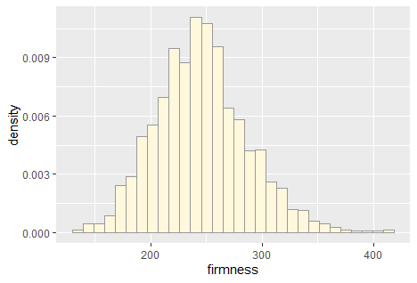

### Add empirical density curve to Blueberry Diploid data

```

p1 <-  p1 +  geom_density(linetype="dotted",size=0.75)
print(p1)

```
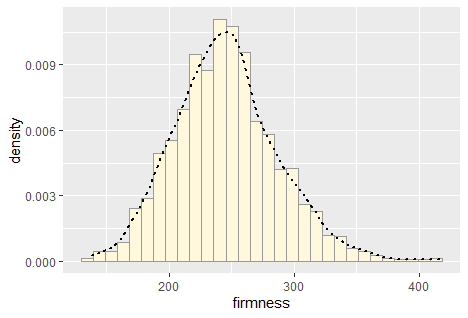

---------------------------------------

### Get maximum likelihood parameters for normal

```
normPars <- fitdistr(b$firmness,"normal")
print(normPars)

mean           sd     
  245.5412764    41.2925569 
 (  1.0464717) (  0.7399672)
 
str(normPars)
normPars$estimate["mean"] 
mean 
245.5413

#### note structure of getting a named attribute
```

### Plot normal probability density

```
meanML <- normPars$estimate["mean"]
sdML <- normPars$estimate["sd"]

xval <- seq(0,max(b$firmness),len=length(b$firmness))

stat <- stat_function(aes(x = xval, y = ..y..), fun = dnorm, colour="red", n = length(b$firmness), args = list(mean = meanML, sd = sdML))
p1 + stat

```
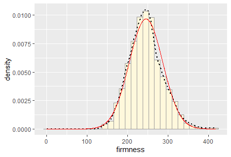

--------------------------------------

### Plot exponential probability density

```
expoPars <- fitdistr(b$firmness,"exponential")
rateML <- expoPars$estimate["rate"]

stat2 <- stat_function(aes(x = xval, y = ..y..), fun = dexp, colour="blue", n = length(b$firmness), args = list(rate=rateML))
p1 + stat + stat2

```
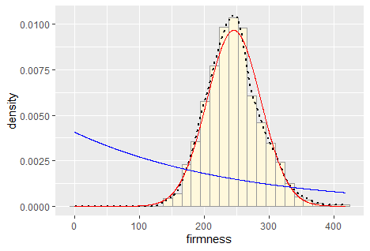

--------------------------------------

### Plot uniform probability density

```
stat3 <- stat_function(aes(x = xval, y = ..y..), fun = dunif, colour="darkgreen", n = length(b$firmness), args = list(min=min(b$firmness), max=max(b$firmness)))
p1 + stat + stat2 + stat3

```
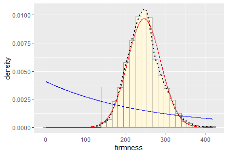

---------------------------------------

### Plot gamma probability density

```
gammaPars <- fitdistr(b$firmness,"gamma")
shapeML <- gammaPars$estimate["shape"]
rateML <- gammaPars$estimate["rate"]

stat4 <- stat_function(aes(x = xval, y = ..y..), fun = dgamma, colour="purple", n = length(b$firmness), args = list(shape=shapeML, rate=rateML))
p1 + stat + stat2 + stat3 + stat4

```

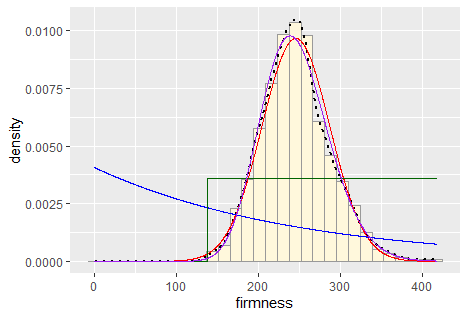

##### Compared to the first data that had errors with the gamma distribution plot, this second data contains values that can be plotted with the gamma distribution

##### The dataset is a good one. it is observed that the normal and gamma distributions fit the data almost equally, it may be confusing to distinguish which distribution best fits the data 


---------------------------------------

### plot beta probability density

```
pSpecial <- ggplot(data=b, aes(x=firmness/(max(firmness + 0.1)), y=..density..)) +
  geom_histogram(color="grey60",fill="cornsilk",size=0.2) + 
  xlim(c(0,1)) +
  geom_density(size=0.75,linetype="dotted")

betaPars <- fitdistr(x=b$firmness/max(b$firmness + 0.1),start=list(shape1=1,shape2=2),"beta")
shape1ML <- betaPars$estimate["shape1"]
shape2ML <- betaPars$estimate["shape2"]

statSpecial <- stat_function(aes(x = xval, y = ..y..), fun = dbeta, colour="orchid", n = length(b$firmness), args = list(shape1=shape1ML,shape2=shape2ML))
pSpecial + statSpecial

```

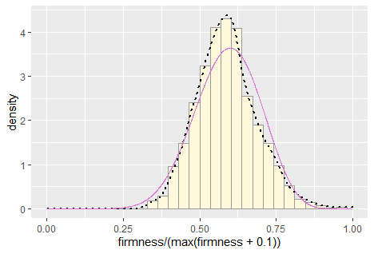

#### The Beta distribution fits the data pretty well because we have assumed the largest data point is the true upper bound, and everything is scaled to that.