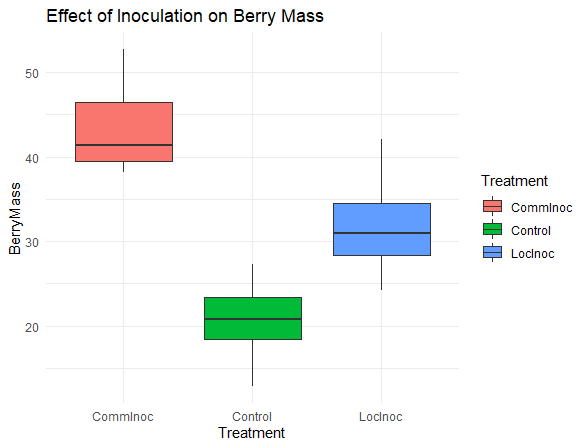

#### This is one of the projects i am currently working on but will generate fake data for the purpose of this assignment.

##### Prediction- inoculation of blueberry plants with microbial inoculum increases berry fruit mass

##### Null hypothesis (Ho)- there is no significant difference between control and treated blueberry plants. Ho=0

##### Alternative hypothesis (Ha)- there is a significant difference between control and treated plants. Ha is not equal to 0

* data should follow normal distribution.
* X =independent/causal variable we manipulate
* Y = dependent/response variable we measure
* what is the signal of the effect of X on Y
* Predictor is discrete- Treatment groups
* Response is continuous - Berry mass
* I will use an ANOVA to see whether the average of response variable among treatment group differs or not.

-----------------------------------------------------------------------------------------------------

```
library(ggplot2)
```

#### Create random dataset

```
bb_group <- 3 #number of treatment group
bb_name <- c("Control","CommInoc","LocInoc") #name of groups
bb_size <- c(17,15,16) #sample sizes
bb_mean <- c(22,45,32) #mean responses
bb_sd <- c(5,5,5) #standard deviation
ID <- 1:sum(bb_size) #creates unique ID

BerryMass <- c(rnorm(n=bb_size[1],mean = bb_mean[1],sd=bb_sd[1]),
               rnorm(n=bb_size[2],mean = bb_mean[2],sd=bb_sd[2]),
               rnorm(n=bb_size[3],mean = bb_mean[3],sd=bb_sd[3]))

Treatment <- rep(bb_name,bb_size)               

```

#### Construct data frame

```
ano_data <- data.frame(ID,Treatment,BerryMass)
head(ano_data)

ID Treatment BerryMass
1  1   Control  12.83643
2  2   Control  18.19585
3  3   Control  18.35359
4  4   Control  19.20687
5  5   Control  23.43929
6  6   Control  25.62070

```

#### Analyze data with ANOVA

```
ano_model <- aov(BerryMass~Treatment,data = ano_data)
print(ano_model)
z <- summary(ano_model)
print(z)

            Df Sum Sq Mean Sq F value Pr(>F)
Treatment    2   4137  2068.7   102.7 <2e-16
Residuals   45    907    20.2               
               
Treatment   ***
Residuals      
---
Signif. codes:  
0 ‘***’ 0.001 ‘**’ 0.01 ‘*’ 0.05 ‘.’ 0.1 ‘ ’ 1

flat_out <- unlist(z)
ano_stats <- list(f_ratio <- unlist(z)[7],f_Pval <- unlist(z)[9])
print(ano_stats)

[[1]]
F value1 
102.6577 

[[2]]
    Pr(>F)1 
1.70338e-17 

```

#### Graph ANOVA data

```
ano_plot <- ggplot(ano_data)+
  aes(x=Treatment,y=BerryMass,fill=Treatment)+
  geom_boxplot()+
  labs(title = "Effect of Inoculation on Berry Mass")+
  theme_minimal()

print(ano_plot)

ggsave(filename = "ANOVAplot.pdf",plot = ano_plot,device = "pdf")

```




-----------------------------------------------------------------------------------------------------

#### Run analysis again with different set of random numbers

###### Create another random dataset

```
bb_group <- 3 #number of treatment group
bb_name <- c("Control","CommInoc","LocInoc") #name of groups
bb_size <- c(17,15,16) #sample sizes
bb_mean <- c(22,45,32) #mean responses
bb_sd <- c(5,5,5) #standard deviation
ID <- 1:sum(bb_size) #creates unique ID

BerryMass <- c(rnorm(n=bb_size[1],mean = bb_mean[1],sd=bb_sd[1]),
               rnorm(n=bb_size[2],mean = bb_mean[2],sd=bb_sd[2]),
               rnorm(n=bb_size[3],mean = bb_mean[3],sd=bb_sd[3]))

Treatment <- rep(bb_name,bb_size)               


ano_data <- data.frame(ID,Treatment,BerryMass)
head(ano_data)

ID Treatment BerryMass
1  1   Control  24.19483
2  2   Control  14.86157
3  3   Control  20.46845
4  4   Control  24.13386
5  5   Control  15.85611
6  6   Control  24.18537


ano_model <- aov(BerryMass~Treatment,data = ano_data)
print(ano_model)
z <- summary(ano_model)
print(z)


            Df Sum Sq Mean Sq F value   Pr(>F)
Treatment    2   3660  1830.2   78.59 2.08e-15
Residuals   45   1048    23.3                 
               
Treatment   ***
Residuals      
---
Signif. codes:  
0 ‘***’ 0.001 ‘**’ 0.01 ‘*’ 0.05 ‘.’ 0.1 ‘ ’ 1

```

*Different sets of random numbers will make the results vary though the parameters are the same*

#### Adjusting the means of the three groups

```
bb_group <- 3 #number of treatment group
bb_name <- c("Control","CommInoc","LocInoc") #name of groups
bb_size <- c(17,15,16) #sample sizes
bb_mean <- c(20,35,30) #mean responses
bb_sd <- c(5,5,5) #standard deviation
ID <- 1:sum(bb_size) #creates unique ID

BerryMass <- c(rnorm(n=bb_size[1],mean = bb_mean[1],sd=bb_sd[1]),
               rnorm(n=bb_size[2],mean = bb_mean[2],sd=bb_sd[2]),
               rnorm(n=bb_size[3],mean = bb_mean[3],sd=bb_sd[3]))

Treatment <- rep(bb_name,bb_size)             


ano_data2 <- data.frame(ID,Treatment,BerryMass)
head(ano_data2)

   ID Treatment BerryMass
1  1   Control  13.91506
2  2   Control  19.25311
3  3   Control  27.73475
4  4   Control  26.46479
5  5   Control  20.94430
6  6   Control  15.55829


ano_model2 <- aov(BerryMass~Treatment,data = ano_data2)
print(ano_model2)
z <- summary(ano_model2)
print(z)


            Df Sum Sq Mean Sq F value   Pr(>F)
Treatment    2   1882   941.0   37.48 2.63e-10
Residuals   45   1130    25.1                 
               
Treatment   ***
Residuals      
---
Signif. codes:  
0 ‘***’ 0.001 ‘**’ 0.01 ‘*’ 0.05 ‘.’ 0.1 ‘ ’ 1

```

* Adjusting the means of the groups still showed a significant difference

##### calculate effect size for original data
* η^2 = SStreat / SStotal = 0.82
* SStreat =treatment sum of squares = 4137
* SStotal =total sum of squares = 4137 + 907 = 5044
* Effect size (f) = √((η^2/(1- η^2) = 2.13

##### calculate effect size for next random data
* η^2 = SStreat / SStotal = 0.78
* Effect size (f) = √((η^2/(1- η^2) = 1.88

##### calculate effect size for adjusted means
* η^2 = SStreat / SStotal = 0.63
* Effect size (f) = √((η^2/(1- η^2) = 1.30

*It is observed that effect size decreases as the mean for each group is reduced*

------------------------------------------------------------------------------------------------------

##### calculate power of test

```
power.anova.test(groups = 3, n=15,between.var =1,within.var = 2,sig.level = 0.05,power = NULL)

         groups = 3
              n = 15
    between.var = 1
     within.var = 2
      sig.level = 0.05
          power = 0.9271035

NOTE: n is number in each group

```

```
power.anova.test(groups = 3, n=16,between.var =1,within.var = 2,sig.level = 0.05,power = NULL)

     Balanced one-way analysis of variance power calculation 

         groups = 3
              n = 16
    between.var = 1
     within.var = 2
      sig.level = 0.05
          power = 0.9433121

NOTE: n is number in each group
```

##### calculate minimal sample size

```
power.anova.test(groups = 3, n=NULL,between.var =1,within.var = 2,sig.level = 0.05,power = 0.9)

     Balanced one-way analysis of variance power calculation 

         groups = 3
              n = 13.70836
    between.var = 1
     within.var = 2
      sig.level = 0.05
          power = 0.9

NOTE: n is number in each group

```

*The kind of data generated for this assignment is more suited for a normal distribution*