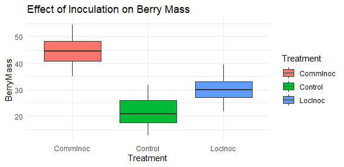
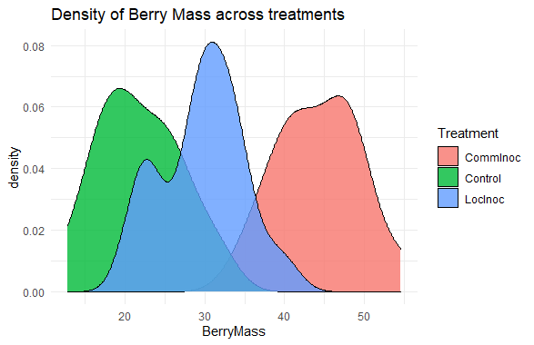

## All functions must be declared at the start


##### FUNCTION: BB_data
##### read in blueberry data
##### input: Mean, variance and size of groups
##### output: dataframe

```
BB_data <- function(bb_size=c(17,15,16), bb_mean=c(22,45,32), bb_sd=c(5,5,5)) {
  
  bb_name <- c("Control","CommInoc","LocInoc")
  
  BerryMass <- c(rnorm(n=bb_size[1],mean = bb_mean[1],sd=bb_sd[1]),
                 rnorm(n=bb_size[2],mean = bb_mean[2],sd=bb_sd[2]),
                 rnorm(n=bb_size[3],mean = bb_mean[3],sd=bb_sd[3]))
  
  Treatment <- rep(bb_name,bb_size) 
  
  ID <- 1:sum(bb_size)
  
  ano_data <- data.frame(ID,Treatment,BerryMass)
  
  return(ano_data)
  
}

```

```
BB_data()

ID Treatment BerryMass
1   1   Control  20.06224
2   2   Control  11.31156
3   3   Control  29.68206
4   4   Control  13.73800
5   5   Control  17.82645
6   6   Control  15.65613
7   7   Control  15.67740
8   8   Control  25.38881
9   9   Control  13.79554
10 10   Control  16.32694
11 11   Control  20.09936
12 12   Control  17.67784
13 13   Control  21.85333
14 14   Control  21.66385
15 15   Control  24.79853
16 16   Control  22.88332
17 17   Control  24.95023
18 18  CommInoc  41.08027
19 19  CommInoc  53.27597
20 20  CommInoc  45.58578
21 21  CommInoc  42.59888
22 22  CommInoc  35.98089
23 23  CommInoc  47.19007
24 24  CommInoc  50.94932
25 25  CommInoc  42.71832
26 26  CommInoc  49.39624
27 27  CommInoc  46.92342
28 28  CommInoc  50.47865
29 29  CommInoc  39.64170
30 30  CommInoc  40.85083
31 31  CommInoc  41.80225
32 32  CommInoc  44.68931
33 33   LocInoc  27.46583
34 34   LocInoc  22.37594
35 35   LocInoc  33.30196
36 36   LocInoc  41.02669
37 37   LocInoc  29.07668
38 38   LocInoc  27.18463
39 39   LocInoc  23.32608
40 40   LocInoc  27.41408
41 41   LocInoc  32.17398
42 42   LocInoc  28.67054
43 43   LocInoc  31.24182
44 44   LocInoc  36.65667
45 45   LocInoc  33.98433
46 46   LocInoc  33.50970
47 47   LocInoc  28.57376
48 48   LocInoc  40.38164

```

##### FUNCTION: BB_Analyze
##### Analyze blueberry data
##### input: dataframe of vectors
##### output: summary of data statistics

```
my_data <- BB_data()
BB_analyze <- function(ano_data=my_data) {
  
  ano_model <- aov(BerryMass~Treatment,data = ano_data)
  
  return(summary(ano_model))
  
}

```

```
BB_analyze()

Df Sum Sq Mean Sq F value   Pr(>F)
Treatment    2   4118  2059.2   77.28 2.79e-15
Residuals   45   1199    26.6                 
               
Treatment   ***
Residuals      
---
Signif. codes:  
0 ‘***’ 0.001 ‘**’ 0.01 ‘*’ 0.05 ‘.’ 0.1 ‘ ’ 1

```

##### FUNCTION: BB_Graph
##### plots blueberry data
##### input: dataframe
##### output: boxplot

```
library(ggplot2)

BB_graph <- function(ano_data=my_data)  {
  ano_plot <- ggplot(ano_data)+
    aes(x=Treatment,y=BerryMass,fill=Treatment)+
    geom_boxplot()+
    labs(title = "Effect of Inoculation on Berry Mass")+
    theme_minimal()
  return(ano_plot)
  
}

BB_graph()

```



# Creating a new function

##### FUNCTION: BB_density
##### density plot shows the distribution of the Berry mass across treatments
##### input: dataframe of vectors
##### output: Density plot

```
library(ggplot2)

BB_density <- function(ano_data=my_data){
  ggplot2::ggplot(data=ano_data, mapping=
                    aes(x=BerryMass , fill=Treatment)) +
    geom_density(alpha=0.8) + 
    labs(title="Density of Berry Mass across treatments", 
         x="BerryMass") + 
    theme_minimal()
}

BB_density()

```

