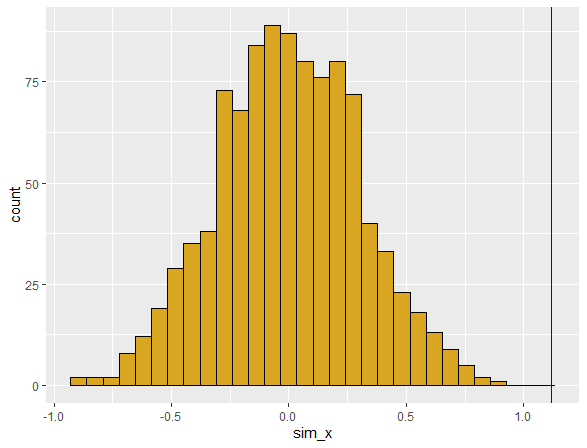

#### 1. use a function to calculate the number of zeros in a numeric vector

```
# FUNCTION my_loop
# description: calculate the number of zeros in a numeric vector
# inputs: numeric vector
# outputs: the number of elements equal to zero
#############################################################

vec <- c(rep(0:7,5))

my_loop <- function(data=vec) {
  counter <- 0
 for(i in (vec)) {
  if(i==0){
    counter = counter + 1
  }}   
    return(counter)
} # end of function

print(my_loop())
# [1] 5

```

#### 2. use subsetting to rewrite the function as a single line of code

```
vec2 <- c(rep(0:7,5))
my_set <- length(vec2[vec2==0])
print(my_set)
 
# [1] 5

```

#### 3. write a function that takes as input two integers representing the number of rows and columns in a matrix

```
# -----------------------------------------------------------
# FUNCTION mat
# description: write a function that takes as input two integers
# inputs: two integers representing the number of rows and column in a matrix
# outputs: a matrix in which each element is the product of the row number and the column number
#############################################################

  
mat <- function(row=4,col=5){
  m <- matrix(data=NA,nrow = row,ncol = col)
    for(i in 1:nrow(m)){
      for(j in 1:ncol(m)){
        m[i,j] <- i*j
      }
    }
    return(m)
  }
mat()  

#       [,1] [,2] [,3] [,4] [,5]
#[1,]    1    2    3    4    5
#[2,]    2    4    6    8   10
#[3,]    3    6    9   12   15
#[4,]    4    8   12   16   20

```

#### 4. Design and conduct a randomization test

```
# -----------------------------------------------------------
# FUNCTION read_data
# description: generate data set for analysis
# inputs: fake data set (I do not have real data)
# outputs: 3 column data frame of observed data (ID, x, y)
#############################################################
read_data <- function(z=NULL){
  if(is.null(z)){
    x_obs <-1:25
    y_obs <- x_obs + 10*rnorm(25)
    df <- data.frame(ID=seq_along(x_obs),
                     x_obs,
                     y_obs)}
  
  return(df)
  
} # end of read_data
# read_data()

# -----------------------------------------------------------
# FUNCTION get_metric
# description: calculate metric for randomization test
# inputs: 2 column data frame for regression
# outputs: regression slope
#############################################################
get_metric <- function(z=NULL){
  if(is.null(z)){
    x_obs <-1:25
    y_obs <- x_obs + 10*rnorm(25)
    z <- data.frame(ID=seq_along(x_obs),
                    x_obs,
                    y_obs)}
  . <-lm(z[,3]~z[,2])
  . <- summary(.)
  . <- .$coefficients[2,1]
  slope <- .
  
  return(slope)
  
} # end of get_metric
#----------------------------------------------------------
# get_metric()


# -----------------------------------------------------------
# FUNCTION shuffle_data
# description: randomize data for regression analysis
# inputs: 3 column data frame (ID,xvar,yvar)
# outputs:  column data frame (ID,xvar,yvar)
#############################################################
shuffle_data <- function(z=NULL){
  if(is.null(z)){
    x_obs <-1:25
    y_obs <- x_obs + 10*rnorm(25)
    z <- data.frame(ID=seq_along(x_obs),
                    x_obs,
                    y_obs)}
  z[,3] <- sample(z[,3])
  
  
    return(z)
  
} # end of shuffle_data
#----------------------------------------------------------
# shuffle_data()


# -----------------------------------------------------------
# FUNCTION get_pval
# description: calculate p value from simulation
# inputs: list of observed metric and vector of simulated metrics
# outputs: lower and upper tail probability value
#############################################################
get_pval <- function(z=NULL){
  if(is.null(z)){
    z <- list(rnorm(1),rnorm(1000))}
  p_lower <- mean(z[[2]]<=z[[1]])
  p_upper <- mean(z[[2]]>=z[[1]])
  
  return(c(pL=p_lower,pU=p_upper))
  
} # end of get_pval
#----------------------------------------------------------
# get_pval()


# -----------------------------------------------------------
# FUNCTION plot_test
# description: create a ggplot of histogram of simulated values
# inputs: list of observed metric and vector simulated metrics
# outputs: saved ggplot graph
#############################################################

library(ggplot2)
plot_test <- function(z=NULL){
  if(is.null(z)){
    z <- list(rnorm(1),rnorm(1000))}
  df <- data.frame(ID=seq_along(z[[2]]), sim_x=z[[2]])
  pl <- ggplot(data=df, mapping=aes(x=sim_x))
  pl + geom_histogram(mapping = aes(fill=I("goldenrod"), color=I("black"))) + 
    geom_vline(aes(xintercept=z[[1]],col="blue"))
  
  
} # end of plot_test
#----------------------------------------------------------
# plot_test()

```

##### Run the simulations using the functions

```

set.seed(100)

n_sim <- 1000   #number of simulated data sets

x_sim <- rep(NA,n_sim)   #set up vector for simulated slopes

df <- read_data()   #get fake data

x_obs <- get_metric(df)   #get slope of observed data

for (i in seq_len(n_sim)){
  x_sim[i] <- get_metric(shuffle_data(df))
}   #run simulation

slopes <- list(x_obs,x_sim)   #make list of slopes

get_pval(slopes)   #get upper and lower tails

# pL pU 
# 1  0 

plot_test(slopes)   #plot graph of slopes

```




#### 5. Compare pValue of standard test with randomization test

```
my_reg <- lm(x_obs~y_obs, data=df)
summary(my_reg)

Call:
  lm(formula = x_obs ~ y_obs, data = df)

Residuals:
  Min      1Q  Median      3Q     Max 
-8.3682 -3.8218  0.7136  2.1542 10.5560 

Coefficients:
  Estimate Std. Error t value
(Intercept)  5.67120    1.61728   3.507
y_obs        0.52045    0.09183   5.667
Pr(>|t|)    
(Intercept)   0.0019 ** 
  y_obs       9.05e-06 ***
  ---
  Signif. codes:  
  0 ‘***’ 0.001 ‘**’ 0.01 ‘*’ 0.05 ‘.’ 0.1 ‘ ’ 1

Residual standard error: 4.856 on 23 degrees of freedom
Multiple R-squared:  0.5827,	Adjusted R-squared:  0.5646 
F-statistic: 32.12 on 1 and 23 DF,  p-value: 9.051e-06

```

*Both the standard test and randomization test have  p-values of zero even when i changed the seed set several times, there is no difference between the values*