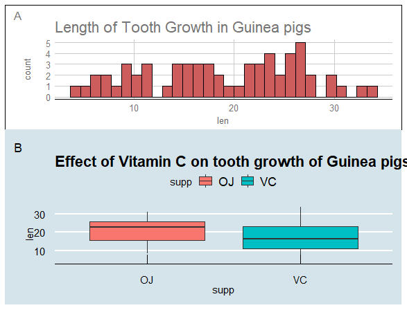

### Advanced ggplotting

##### For this exerise, use your newly-developed ggplot chops to create some nice graphs from your own data (If you do not have a good data frame to use for graphics, use one of the many built-in data frames from R (other than mpg, which we are using in class)). 

##### Experiment with different themes, theme base sizes, aesthetics, mappings, and faceting. When you are finished, try exporting them to high quality pdfs, jpgs, eps files, or other formats that you would use for submission to a journal.

------------------------------------------------------------------------------------------------------

##### Preliminaries

```
library(ggplot2)
library(ggthemes)
library(TeachingDemos)
library(help="datasets")
library(datasets)
library(dplyr)
library(patchwork)
 
char2seed("talking trees")

```


##### Make ggplot with different themes and base sizes

```
my_data <- ToothGrowth # use built in data for Effect of Vitamin C on tooth growth of guinea pigs

str(ToothGrowth)
'data.frame':	60 obs. of  3 variables:....

head(ToothGrowth)
   len supp dose
1  4.2   VC  0.5
2 11.5   VC  0.5
3  7.3   VC  0.5
4  5.8   VC  0.5
5  6.4   VC  0.5
6 10.0   VC  0.5


s1 <- ggplot(data = my_data,
             mapping=aes(x=len, fill=I("Indianred"), color=I("black"))) +
  theme_gdocs(base_size = 10, base_family = "sans") +
  labs(title = "Length of Tooth Growth in Guinea pigs") +
  geom_histogram() 
  
print(s1)


```


---------------------------------------------------------------------------------------------------------


##### Use another theme, base size, base family and title

```

s2 <- ggplot(data=my_data,
             mapping = aes(x=supp, y=len,
                           fill=supp)) +
  theme_economist(base_size = 20, base_family = "serif") +
  labs(title = "Effect of Vitamin C on tooth growth of Guinea pigs") +
  geom_boxplot() 
  
print(s2)


```


------------------------------------------------------------------------------------------------------


##### Combine plots using patchwork

```

s1 / s2 + 
  plot_annotation(tag_levels = "A")
  


```



------------------------------------------------------------------------------------------------------


##### make new plots with mapping asthetics using different data

```

SecondData <- trees    # use another built in data of girth, height and volume of Black cherry trees

str(trees)
'data.frame':	31 obs. of  3 variables:.....

head(trees)
   Girth Height Volume
1   8.3     70   10.3
2   8.6     65   10.3
3   8.8     63   10.2
4  10.5     72   16.4
5  10.7     81   18.8
6  10.8     83   19.7

```

##### map a continuous variable to point color and add labels

```
m1 <- ggplot(data = SecondData,
             mapping = aes(x=Height,
                           y=Girth,
                           color=Volume)) + 
  labs(title = "Black cherry tree measurements", x="height of Black cherry trees", y= "Girth of Trees") +
  geom_point(size=5)
print(m1)


```


------------------------------------------------------------------------------------------------------


##### map a variable to the same aesthetic in two different geom

```
m2 <- ggplot(data = SecondData,
             mapping = aes(x=Height,
                           y=Girth,
                           color=Volume)) +
  labs(title = "Regression analysis of Black cherry tree measurements", x="height of Black cherry trees", y= "Girth of Trees")+
  geom_point(size=2) +
  geom_smooth(method = "lm")
  
print(m2)


```


------------------------------------------------------------------------------------------------------


##### basic faceting with variables split by row, column or both

```

m3 <- ggplot(data = SecondData,
             mapping = (aes(x=Height,
                            y=Girth))) +
  labs(title = "Faceting Black cherry tree measurements", x="height of Black cherry trees", y= "Girth of Trees")+
  geom_point()

m3 + facet_wrap(.~Girth)


```


------------------------------------------------------------------------------------------------------